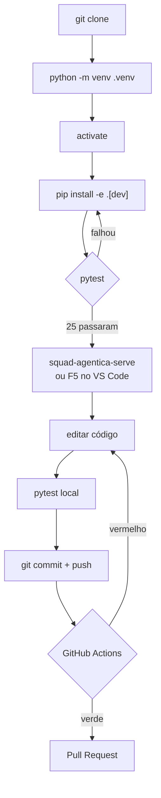
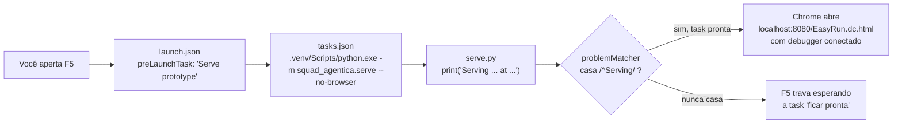
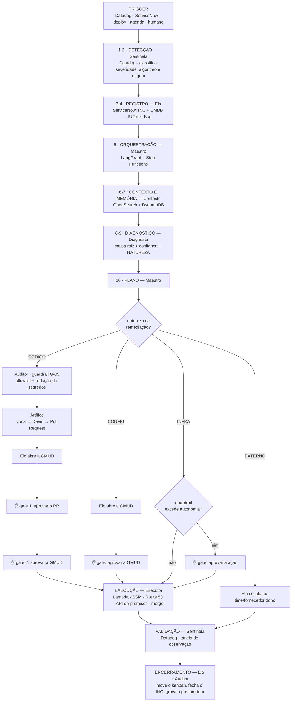

# 05 — Processo end-to-end

[← Frontend / protótipo](04-frontend-prototype.md) · [Índice](README.md) · [Próximo: Arquitetura-alvo →](06-arquitetura-alvo.md)

---

Este é o documento central. Ele descreve as **duas jornadas** do EasyRun:

- **A** — o ciclo do desenvolvedor: do `git clone` ao CI verde.
- **B** — o ciclo do incidente: da anomalia detectada ao pós-mortem gravado.

São processos diferentes, com públicos diferentes. Se você vai apresentar o projeto, a
jornada B é o que importa. Se vai contribuir com código, a A.

---

# A) Ciclo do desenvolvedor



## Passo 1 — Obter o código

```bash
git clone https://github.com/adfshownet/EasyRun.git
cd EasyRun
```

Confira em qual branch você está: `git branch`. O trabalho recente está em
`feature/python-package` — ver [07 — Modelo de branches](07-ci-cd-e-git.md#modelo-de-branches).

## Passo 2 — Criar e ativar o ambiente

```bash
python -m venv .venv
.venv\Scripts\activate          # Windows
source .venv/Scripts/activate   # Git Bash no Windows
source .venv/bin/activate       # Linux / macOS
```

O que acontece e por quê: [02 — `.venv`](02-ambiente-e-ferramentas.md#venv--o-ambiente-virtual).

## Passo 3 — Instalar o projeto

```bash
pip install -e ".[dev]"
```

Três efeitos, nesta ordem:

1. O `pip` lê o [`pyproject.toml`](../pyproject.toml) e chama o setuptools.
2. `squad_agentica` passa a ser importável — **apontando para `src/`**, não copiado
   (é o `-e`, ver [02](02-ambiente-e-ferramentas.md#pip-install--e-dev--dissecando-o-comando)).
3. O executável `squad-agentica-serve` é criado em `.venv/Scripts/`.

Sem este passo, nada mais funciona: nem `pytest` (o `import` falha) nem o comando de
servidor (ele não existe).

## Passo 4 — Rodar os testes

```bash
pytest
```

Resultado esperado: **25 testes passando** (17 funções, duas delas parametrizadas).
O `pytest` descobre `tests/` sozinho, por convenção de nome. Detalhes em
[03 — Testes](03-arquitetura-do-codigo.md#testes).

## Passo 5 — Subir o mockup

Três formas, do mais simples ao mais integrado:

```bash
squad-agentica-serve                              # sobe na 8080 e abre o navegador
squad-agentica-serve --no-browser --port 8081     # sem abrir, porta alternativa
python -m squad_agentica.serve                    # sem depender do console script
```

O servidor imprime:

```
Serving C:\...\EasyRun\prototype at http://localhost:8080/EasyRun.dc.html (Ctrl+C to stop)
```

`Ctrl+C` encerra em silêncio.

### A cadeia do F5 no VS Code

Apertar **F5** dispara uma sequência de quatro elos que vale entender, porque quando o F5
quebra, é sempre um deles:



**Elo 1 — [`.vscode/launch.json`](../.vscode/launch.json)**

```jsonc
{
  "type": "chrome",
  "request": "launch",
  "name": "Launch Chrome against localhost",
  "url": "http://localhost:8080/EasyRun.dc.html",
  "webRoot": "${workspaceFolder}/prototype",
  "preLaunchTask": "Serve prototype"
}
```

`preLaunchTask` diz: *antes de abrir o Chrome, execute a task com este nome*.
`webRoot` mapeia as URLs do navegador para arquivos em disco, o que permite ao debugger
colocar breakpoints no JavaScript do protótipo.

**Elo 2 — [`.vscode/tasks.json`](../.vscode/tasks.json)**

```json
{
  "label": "Serve prototype",
  "type": "shell",
  "command": "${workspaceFolder}/.venv/Scripts/python.exe",
  "args": ["-m", "squad_agentica.serve", "--no-browser"],
  "isBackground": true,
  "problemMatcher": { ... }
}
```

Note três decisões:
- chama o `python.exe` do `.venv` **pelo caminho completo**, sem depender de ambiente
  ativado (⚠️ Windows-only — [09 #3](09-lacunas-e-riscos.md#3-o-f5-do-vs-code-só-funciona-no-windows));
- usa `-m squad_agentica.serve` em vez do console script, o que funciona mesmo se o
  `pip install` foi feito sem o entry point registrado;
- `--no-browser`, porque quem abre o navegador é o `launch.json`.

**Elo 3 — o `problemMatcher`**

```json
"problemMatcher": {
  "pattern": { "regexp": "^(Serving) (.*) at (.*)$", "file": 2, "location": 3 },
  "background": {
    "activeOnStart": true,
    "beginsPattern": "^Serving",
    "endsPattern": "^Serving"
  }
}
```

Este bloco resolve um problema real: `isBackground: true` significa que a task **nunca
termina** (o servidor fica rodando). Sem mais informação, o VS Code esperaria eternamente
a task "concluir" antes de abrir o Chrome.

O `background` diz ao VS Code *como saber que a task já está pronta mesmo sem terminar*:
observe a saída e considere-a pronta quando aparecer uma linha começando com `Serving`.

⚠️ Isso cria um acoplamento invisível: o texto do `print()` no
[`serve.py`](../src/squad_agentica/serve.py) é **contrato** com o `tasks.json`. Ver
[09 #4](09-lacunas-e-riscos.md#4-o-problemmatcher-está-acoplado-ao-texto-do-print).

**Elo 4 — o Chrome abre** na URL do `launch.json`, com o debugger acoplado.

## Passo 6 — Editar

| O que você quer mudar | Onde | Como verificar |
|---|---|---|
| Contrato de tipos AIOps | `src/squad_agentica/aiops/*.py` | `pytest` |
| Servidor local | `src/squad_agentica/serve.py` | rodar e acessar |
| Dashboard | `prototype/EasyRun.dc.html` | recarregar o navegador **+ replicar no `export/`** |
| Runtime `dc` | ⛔ `support.js` é gerado — não edite | — |

## Passo 7 — Commit e push

```bash
git add .
git commit -m "descrição do que mudou"
git push origin feature/python-package
```

O `.gitignore` já impede que `.venv/`, `__pycache__/` e `*.egg-info/` entrem no commit —
confira com `git status` antes.

## Passo 8 — O CI

O push dispara o GitHub Actions, se os arquivos alterados casarem com os filtros de
`paths`. O workflow monta um Ubuntu limpo, instala o Python 3.12, roda
`pip install -e ".[dev]"` e `pytest`. Detalhes campo a campo em
[07 — CI/CD e Git](07-ci-cd-e-git.md).

⚠️ Editar **só** `prototype/` não dispara nenhum workflow — os filtros cobrem apenas
`src/`, `tests/`, `pyproject.toml` e o próprio workflow.

---

# B) Ciclo do incidente AIOps

> Esta é a jornada que o produto **promete**. Hoje ela está encenada no mockup, passo a
> passo, mas nenhuma parte dela executa de verdade. Ver
> [01 — Quadro de maturidade](01-visao-geral.md#quadro-de-maturidade).

## O que mudou em relação a um fluxo AIOps genérico

Três coisas, e são elas que fazem o EasyRun se parecer com a empresa:

1. **A entrada não é só telemetria.** Um incidente pode chegar pelo Datadog (métrica, log,
   error tracking) ou pelo ServiceNow (chamado aberto por uma pessoa) — e o segundo caso é
   o único que enxerga incidente de negócio.
2. **Depois do diagnóstico há uma bifurcação.** O Diagnosta classifica a **natureza da
   remediação**, e é ela que decide quem executa e qual é o artefato final: um comando, um
   pull request, uma GMUD ou um escalonamento.
3. **A burocracia acontece durante, não depois.** O incidente do ServiceNow, o card do
   IUClick e a GMUD são abertos e movidos ao longo da esteira, não no fim.

## O fluxo completo



Abaixo, cada etapa ancorada no cenário **ANM-2047** (latência no checkout-api), que é o
padrão do protótipo. Onde o ramo `CODIGO` diverge, a diferença está marcada.

### 0 — O trigger

A squad não fica adivinhando. Cinco gatilhos podem acioná-la:

| Gatilho | Plataforma | Quando dispara |
|---|---|---|
| 🚨 Monitor de anomalia | Datadog | Desvio em latência, erro ou saturação; error tracking; monitor sintético |
| 🎫 Incidente aberto | ServiceNow | Chamado registrado por uma pessoa — **inclui incidente de negócio** |
| 📡 Evento de deploy | EventBridge | Todo deploy em produção coloca a squad em observação ativa |
| ⏰ Varredura agendada | EventBridge | Auditoria de saúde e forecast a cada 15 minutos |
| 💬 Solicitação humana | API Gateway | Um operador aciona a squad pelo chat |

O gatilho do ServiceNow é o que amplia o alcance: no cenário INC-3350, catorze chamados da
área financeira em quarenta minutos abrem um incidente **com todas as métricas de
infraestrutura normais**. Nenhum monitor teria disparado.

### 1 — Detecção

*Sentinela 🛰️ · Datadog*

> *"Monitor do Datadog disparou: latência p99 do checkout-api em 2.840ms (limiar: 650ms).
> Anomalia ANM-2047 aberta · severidade CRÍTICO · algoritmo Robust."*

**p99** significa: 99% das requisições foram mais rápidas que esse valor. É a métrica certa
para experiência do usuário, porque a média esconde o problema — uma média de 200 ms pode
conviver com 1% dos clientes esperando 3 segundos, e esse 1% é quem abre chamado.

Aqui a Sentinela classifica três coisas: **severidade** (Crítico), **algoritmo de
detecção** (Robust — a série é estável, o desvio é anomalia real) e **origem** (Datadog).
Ver [03 — severity.py](03-arquitetura-do-codigo.md#severitypy).

### 2 — Evento no barramento

*Sentinela 🛰️ · EventBridge*

> *"Evento `anomalia.detectada` publicado no barramento com o trace dd-9f2c4a1e."*

Um **barramento de eventos** desacopla quem detecta de quem age: a Sentinela não chama o
Maestro diretamente, ela anuncia o fato. Isso permite acrescentar consumidores — um
notificador de Slack, um painel — sem tocar em quem publica. E o `trace_id` já viaja junto
desde aqui: é ele que vai amarrar Datadog, Langfuse, LangSmith e ServiceNow.

### 3 — Registro e CMDB

*Elo 🔗 · ServiceNow*

> *"Incidente INC-0098431 correlacionado no ServiceNow. Consulta à CMDB: item de
> configuração svc-checkout-api, ambiente produção, time dono Squad Pagamentos."*

Duas informações são extraídas da **CMDB** (o inventário de itens de configuração), e a
segunda é decisiva:

- **quem é o dono** — para escalar, se for preciso;
- **qual repositório sustenta o serviço** — sem isso, o ramo `CODIGO` não existe, porque o
  Artífice não teria o que clonar.

Na prática esse é o campo com maior chance de estar vazio numa CMDB real, e a esteira
precisa degradar com elegância: sem repositório, o caminho é escalar com o diagnóstico
pronto. Ver [10 — ServiceNow](10-ecossistema-da-empresa.md#servicenow).

### 4 — Card no kanban

*Elo 🔗 · IUClick*

> *"Card BUG-4471 criado no board da squad (coluna 'A fazer') e vinculado ao INC-0098431 —
> rastreabilidade ágil aberta sem ninguém preencher formulário."*

O card nasce **no começo**, não no fim. É deliberado: agrupar todos os registros na
conclusão deixaria o incidente invisível para quem está fora da ferramenta justamente
enquanto ele está sendo trabalhado — que é quando o board mais importa.

### 5 — Orquestração

*Maestro 🎼 · Step Functions · LangGraph*

> *"Execução iniciada no grafo LangGraph. Decompondo em tarefas: recuperar contexto →
> diagnosticar → classificar natureza → planejar → agir → avaliar."*

O Maestro é uma **máquina de estados**: sabe qual etapa vem depois de qual, o que fazer se
uma falhar e onde é possível pausar.

### 6–7 — Contexto e memória

*Contexto 🧠 · OpenSearch + DynamoDB*

Duas camadas distintas de memória:

| Camada | O que guarda | Onde | Analogia humana |
|---|---|---|---|
| **Semântica** | Runbooks vetorizados, conhecimento geral | OpenSearch | "O que eu sei sobre latência de API" |
| **Episódica** | Incidentes já vividos, com desfecho e eficácia | DynamoDB | "Já vi exatamente isso em março" |

> *"INC-1893 teve a mesma assinatura logo após um deploy — resolvido com rollback (eficácia
> 96%)."*

**Busca semântica** funciona por significado, não por palavra exata: o texto vira um
*embedding* (vetor numérico) e a busca acha os vetores mais próximos. Assim, "API lenta
depois do deploy" recupera um runbook chamado "Degradação de latência pós-release", sem
nenhuma palavra em comum.

Esta é a etapa que faz a squad **melhorar com o tempo**. E vale notar o caso contrário: no
cenário INC-3312, a busca não encontra runbook nem episódio — *"defeito novo"*. A ausência
de precedente já é um sinal de que a resposta não será operacional.

### 8–9 — Diagnóstico e natureza

*Diagnosta 🔬 · Datadog + IARA MCP*

> *"Causa provável: esgotamento do pool de conexões RDS por vazamento introduzido no deploy
> v2.14.3. Confiança: 92%. **Natureza da remediação: INFRA** — resolve em runtime, sem
> alterar código."*

Três pontos:

**A correlação temporal é a pista principal.** Deploy às 14:00, pico às 14:02. Não é prova,
mas é o primeiro lugar onde qualquer engenheiro experiente olharia.

**A confiança é explícita.** O agente diz *"causa provável, 92%"*, não *"a causa é"*. Isso
alimenta o campo `confidence` do [`AgentState`](03-arquitetura-do-codigo.md#statepy). Nos
oito cenários ela varia de **89%** (DNS, sem histórico) a **96%** (terceiro degradado, com
evidência clara) — o número acompanha a qualidade da evidência.

**A natureza é a bifurcação.** É aqui que o fluxo deixa de ser único:

| Natureza | Quem executa | Artefato final | Cenário |
|---|---|---|---|
| `INFRA` | Executor ⚡ | Comando aplicado | ANM-2047, 2091, 2118, 2150, PRD-2144 |
| `CODIGO` | Artífice 🛠️ → Devin | **Pull request** | INC-3312 |
| `CONFIG` | Executor ⚡ | Mudança sob **GMUD** | INC-3350 |
| `EXTERNO` | Elo 🔗 | **Escalonamento** | INC-3377 |

No cenário INC-3312 a frase é outra e diz tudo: *"Natureza: CÓDIGO — nenhuma ação de
runtime corrige isto; o software precisa mudar."*

### 10 — Plano de remediação

*Maestro 🎼 · Step Functions*

| # | Passo | Estado inicial |
|---|---|---|
| 1 | Congelar novos deploys do checkout-api | ✅ `ok` |
| 2 | Rollback do deploy v2.14.3 → v2.14.2 | ✋ `hitl` |
| 3 | Escalar pool de conexões RDS (50 → 120) | ⏳ `pendente` |
| 4 | Validar métricas por 10 min e encerrar | ⏳ `pendente` |

Repare na ordem: **congelar deploys vem primeiro**. Antes de corrigir, estanca a fonte — se
alguém publicar outra versão no meio da remediação, o diagnóstico vira ruído. É o
equivalente a fechar o registro antes de enxugar o chão.

O passo 2 já nasce marcado como `hitl`: o plano sabe, desde a criação, que precisará de
autorização.

### 11 — Guardrails

*Auditor 🛡️*

> *"Guardrail G-02 interceptou o passo 2: 'rollback em produção' excede a autonomia da
> squad. Encaminhado para aprovação humana (HITL)."*

**Guardrail** é uma política explícita que limita o que os agentes podem fazer sozinhos.
Não é o LLM decidindo se deve pedir permissão — é uma regra determinística, avaliada fora
do modelo.

#### Os guardrails

| ID | Nome | Regra | Padrão |
|---|---|---|---|
| G-01 | Aprovação humana p/ rollback | Toda reversão de deploy em produção passa pela fila HITL | ligado |
| G-02 | Limite de ações de escrita | Máximo de 3 mutações de infraestrutura por execução | ligado |
| G-03 | Escopo de ambiente | Agentes só atuam nos serviços sob domínio da squad | ligado |
| G-04 | Modo somente-leitura noturno | Entre 0h e 6h, ações de escrita são bloqueadas | **desligado** |
| G-05 | **Redação antes da saída** | Segredos e dados pessoais removidos antes de enviar código ao Devin; só repositórios da allowlist | ligado |
| G-06 | **Revisão de código de agente** | Nenhum PR gerado por agente é mergeado sem revisão humana | ligado |
| G-07 | **GMUD aprovada** | Toda mudança em produção exige gestão de mudança aprovada | ligado |

Cada um cobre um modo de falha diferente: G-01 protege a ação de maior impacto; G-02 limita
o estrago de um agente em laço; G-03 confina o raio de alcance; G-04 evita mudanças sem
ninguém acordado; G-05 impede vazamento de código da empresa; G-06 e G-07 garantem que a
decisão final continue humana.

⚠️ Há uma inconsistência de rotulagem herdada do protótipo: a lista de configuração numera
"aprovação humana p/ rollback" como o primeiro guardrail, mas o log do ANM-2047 cita
**G-02** para o rollback e o gate do ANM-2091 cita **G-01** para o escalonamento. Ver
[09 #11](09-lacunas-e-riscos.md#11-numeração-dos-guardrails-inconsistente-no-mockup).

### 12 — A fila HITL

*✋ decisão humana*

**HITL** = *Human-In-The-Loop*, humano no circuito. **A execução para aqui.** No mockup isso
é literal: o laço `setTimeout` não é reagendado, e a simulação congela até alguém clicar.

Há **três tipos de gate**, porque as três decisões pedem informações diferentes:

| Tipo | Pergunta que responde | Campos específicos |
|---|---|---|
| **Ação** | "Autorizo a squad a fazer isso na infraestrutura?" | comando, justificativa, memória |
| **Pull request** | "Este patch está correto?" | repositório, branch, arquivos alterados, checks de CI |
| **GMUD** | "Agora é hora de mexer em produção?" | número da mudança, CI afetado, janela, plano de rollback |

O card de ação do ANM-2047:

```
APR-01 · AÇÃO · Rollback de deploy em produção            risco: médio
Guardrail: G-02 · rollback exige humano       AWS: Lambda · CodeDeploy

O plano da squad propõe reverter o checkout-api de v2.14.3 para v2.14.2.

  $ easyrun executar rollback \
      --servico checkout-api \
      --de v2.14.3 --para v2.14.2 \
      --estrategia blue-green

  Justificativa do Diagnosta: vazamento de conexões
  introduzido em v2.14.3 (confiança 92%).
  Memória: INC-1893 resolvido com a mesma ação.

              [ ✅ Aprovar ]   [ 🚫 Rejeitar ]
```

Quatro informações, deliberadamente juntas: **o que** será feito, **por que**, **com que
precedente** e **qual o risco**. O humano decide em segundos sem precisar investigar por
conta própria — que é o ponto inteiro da automação assistida.

#### Por que o ramo `CODIGO` para duas vezes

Aprovar uma mudança de código e aprovar uma janela de mudança em produção são **autoridades
diferentes**, normalmente exercidas por pessoas diferentes: a primeira é técnica (o patch
está correto?), a segunda é de risco operacional (agora é hora de mexer em produção?).
Fundir as duas é o tipo de simplificação que não sobrevive ao primeiro comitê de mudança.

E se o PR for **rejeitado**, o gate da GMUD não chega a aparecer — o passo é pulado
(`pularSeRejeitado`), porque não se pede janela de mudança para um patch recusado.

#### Os dois caminhos

| | Aprovado ✅ | Rejeitado 🚫 |
|---|---|---|
| ANM-2047 | Rollback v2.14.3 → v2.14.2 | Reciclar instâncias do pool **sem** reverter |
| INC-3312 | Merge + deploy do PR #217 | Feature flag desligada; PR fica aberto para revisão |
| INC-3350 | Parâmetro restaurado no ERP | Incidente reatribuído à Squad Financeiro |
| INC-3377 | Roteamento para o adquirente B | Nenhuma ação; escalonamento ao fornecedor |

O ponto de design: **rejeitar não é abortar**. A squad tem um plano B — menos eficaz, porém
mais conservador. Um sistema que só sabe fazer o que propôs coloca o operador numa escolha
binária ruim ("aprove ou fique sem correção").

Há ainda a terceira via, a **auto-aprovação** (prop `autoAprovar`), que registra no log a
mensagem correspondente deixando claro que quem decidiu foi a máquina — a trilha de
auditoria distingue os três casos.

### 13 — Execução

*Executor ⚡ ou Artífice 🛠️, conforme a natureza*

**Ramo `INFRA`** — Lambda, SSM, ASG, Route 53:

> *"Executando rollback: checkout-api v2.14.3 → v2.14.2 via Lambda de deploy."*
> *"Escalando pool de conexões RDS: max_connections 50 → 120 via Parameter Store."*

**Ramo `CODIGO`** — a sequência completa do INC-3312:

1. **Guardrail G-05** confirma a allowlist e remove segredos do contexto.
2. Artífice **clona** `acme-corp/frete-service` e localiza o trecho.
3. Abre a **sessão `devin-8842`** com diagnóstico, stack trace e código.
4. Devin devolve o patch → **PR #217** aberto, 2 arquivos, 1 teste novo, CI verde.
5. Elo abre a **GMUD CHG-0044120** automaticamente.
6. Dois gates. Depois, merge e deploy pela esteira da organização.

**Ramo `CONFIG`** — no INC-3350, a ação é uma chamada à API do ERP on-premises. Nenhum
serviço AWS envolvido, e o log diz isso explicitamente.

**Ramo `EXTERNO`** — não há execução: o Elo reatribui o incidente ao fornecedor com traces,
janela de impacto e cláusula de SLA anexados.

### 14 — Validação

*Sentinela 🛰️ · Datadog*

> *"Latência p99 caindo no Datadog: 2.840ms → 610ms (−78%). Erros 5xx zerados. Janela de
> validação de 10 min iniciada."*

Etapa frequentemente esquecida em automações: **confirmar que funcionou**. Não basta
executar a ação — é preciso observar a métrica voltar ao normal e sustentar-se por uma
janela de tempo. Os 610 ms finais estão abaixo do limiar de 650 ms que disparou o alarme: o
ciclo fecha contra o mesmo critério que o abriu.

### 15 — Encerramento dos registros

*Elo 🔗 · IUClick + ServiceNow*

> *"BUG-4471 movido para 'Concluído' no IUClick. INC-0098431 encerrado no ServiceNow com a
> nota de resolução e o link do trace."*

E quando não deu certo, o texto muda de acordo: card para "Em revisão" (PR rejeitado),
"Impedido" (mudança não autorizada) ou "Aguardando terceiro" (natureza `EXTERNO`).

### 16 — Pós-mortem e aprendizado

*Auditor 🛡️ · S3 + Langfuse*

> *"Pós-mortem automático gerado e salvo. Trace completo da execução disponível no
> Langfuse. Aprendizado gravado na memória de longo prazo."*

Este é o passo que fecha o **ciclo de melhoria contínua**, agora em duas direções:

- o episódio volta para a **memória**, e o próximo incidente com a mesma assinatura já
  começa com a hipótese pronta;
- o caso entra no **golden set** de avaliação, e passa a ser um dos testes que julgam a
  próxima versão dos agentes (ver [11 — Golden set](11-mlops-llmops.md#3-golden-set-de-incidentes)).

E o encerramento, com o número que resume o argumento:

> *"ANM-2047 resolvida ✅ MTTR: 4m 32s (média humana: 38m)."*

No INC-3312 a comparação é ainda mais forte, porque muda de ordem de grandeza:

> *"MTTR: 18m 40s, com correção de código em produção (média humana para defeito de código:
> 2 a 5 dias)."*

---

## Comparando os 8 cenários

| | **ANM-2047** 🐢 | **ANM-2091** 📈 | **ANM-2118** 🌐 | **PRD-2144** 🔮 | **INC-3312** 🧬 | **INC-3350** 💼 | **INC-3377** ⛔ | **ANM-2150** 🐕 |
|---|---|---|---|---|---|---|---|---|
| Origem | Datadog | Datadog | Datadog | Agendado | Datadog + ServiceNow | **ServiceNow** | Datadog | **Datadog Watchdog** |
| Severidade | Crítico | Alerta | Crítico | Preditivo | Crítico | Crítico | Alerta | Alerta |
| Algoritmo | Robust | Agile | Basic | Robust | Robust | Agile | Agile | **Watchdog (IA)** |
| **Natureza** | `INFRA` | `INFRA` | `INFRA` | `INFRA` | **`CODIGO`** | **`CONFIG`** | **`EXTERNO`** | `INFRA` |
| Confiança | 92% | 95% | 89% | 93% | 94% | 91% | 96% | 90% |
| Memória disponível | INC-1893 | INC-1777 | **nenhuma** | INC-1622 | **nenhuma** | INC-1409 | INC-1988 | INC-2011 |
| Gates HITL | 1 (ação) | 1 (ação) | — | — | **2 (PR + GMUD)** | 1 (GMUD) | 1 (ação) | — |
| Onde a ação acontece | AWS | AWS | AWS | AWS | GitHub org | **ERP on-premises** | — (escala) | AWS + Datadog |
| Elos de rastreio | 5/9 | 5/9 | 5/9 | 5/9 | **9/9** | 6/9 | 5/9 | 5/9 |
| Desfecho | MTTR 4m 32s | 6m 05s | **2m 18s** | 3m 40s | 18m 40s | 22m 05s | contido em 7m 12s | 5m 44s + monitor criado |

### Por que três cenários não têm gate nenhum

A resposta revela o critério de autonomia do sistema, e ele **não é a severidade**:

**ANM-2118 (DNS) é Crítico e mesmo assim roda sozinho.** O log explica: *"execução
imediata, sem espera humana (severidade crítica + ação reversível)"*. Um failover de rota
DNS é trivialmente reversível — basta apontar de volta. Somado à urgência, esperar
aprovação custaria mais do que o risco de errar. Resultado: o menor MTTR dos oito.

**PRD-2144 (disco) roda sozinho por motivo oposto.** É preditivo, não há urgência nenhuma —
e a ação (expandir um volume EBS) é **não-destrutiva**: adiciona capacidade sem remover
nada.

**ANM-2150 (Watchdog) roda sozinho pelo mesmo critério.** Um rolling restart não muda
versão nem configuração persistente — é reversível por definição. O que o cenário
acrescenta está na **detecção**: a anomalia foi encontrada pelo Watchdog do Datadog, por
IA, sem que nenhum monitor cobrisse a métrica — e o desfecho inclui criar o monitor que
faltava, para que o ponto cego não dependa do Watchdog na próxima vez.

Os demais param porque suas ações são difíceis de reverter (rollback, merge em produção),
financeiramente comprometedoras (escalar acima do orçamento, rotear pagamento por um
adquirente mais caro) ou formalmente exigidas (mudança em sistema financeiro).

O critério, então, é **reversibilidade × custo do erro**, não gravidade do incidente.

### Por que o algoritmo de detecção muda tudo

O ANM-2091 é o caso mais instrutivo. CPU a 92% parece anomalia óbvia — mas o algoritmo
**Agile** (baseado em SARIMA, um modelo de séries temporais com sazonalidade) reconheceu
que havia uma campanha de marketing ativa e classificou o desvio como **novo normal
sazonal**, não como falha:

> *"Conclusão: saturação legítima por tráfego, não é vazamento nem regressão."*

O diagnóstico correto muda a ação: não adianta reverter deploy nenhum (não houve deploy) —
o que resolve é dar mais capacidade.

### Por que a natureza muda ainda mais

O INC-3312 é o contraponto. Um sistema que só soubesse agir em infraestrutura teria
reiniciado o `frete-service`, visto os erros sumirem por alguns minutos e fechado o
incidente. O defeito continuaria no código e voltaria no próximo pico de tráfego — com o
agravante de agora existir um registro dizendo que "foi resolvido".

Classificar a natureza como `CODIGO` é o que impede esse falso positivo. E é por isso que a
métrica de acerto do roteamento tem limiar mais rígido que a da explicação da causa raiz
(ver [11 — Portão de regressão](11-mlops-llmops.md#4-llm-as-judge-com-portão-de-regressão)).

### Por que saber desistir é um resultado

O INC-3377 termina sem que a squad conserte nada — e isso é o comportamento correto. A
degradação está no gateway de um adquirente, fora do perímetro da empresa. A squad:

1. isola a falha e prova que o problema não é nosso (confiança 96%);
2. propõe um workaround **com o custo explícito** (+R$ 0,42 por transação, ~43k
   transações/h, e a memória de que o INC-1988 custou R$ 18k com essa mesma ação);
3. aceita a recusa como decisão legítima;
4. escala formalmente ao fornecedor, com traces e cláusula de SLA anexados;
5. move o card para "Aguardando terceiro" — coluna que existe justamente para isso.

Como o log resume: *"Saber parar é um resultado."* Numa apresentação, esse costuma ser o
cenário que responde à pergunta mais difícil da sala.

---

## Como os dois ciclos se conectam hoje (e como se conectarão)

**Hoje:** não se conectam. A jornada A produz um servidor que entrega um HTML; a jornada B
acontece inteiramente dentro desse HTML, encenada com dados fixos. O pacote Python não
participa da simulação.

**No alvo:** o ciclo B seria executado por um grafo LangGraph no backend, e o dashboard
consumiria seu estado real via API. O `AgentState` que hoje é só um `TypedDict` seria o
objeto que trafega entre os nós; os gates HITL seriam `interrupt()` de verdade; os
checkpoints iriam para PostgreSQL; e os campos de rastreabilidade seriam preenchidos por
chamadas reais ao ServiceNow, ao IUClick e ao GitHub. Ver
[06 — Arquitetura-alvo](06-arquitetura-alvo.md) e
[10 — Ecossistema da empresa](10-ecossistema-da-empresa.md).

---

[← Frontend / protótipo](04-frontend-prototype.md) · [Índice](README.md) · [Próximo: Arquitetura-alvo →](06-arquitetura-alvo.md)
