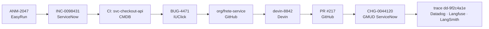

# 10 — Ecossistema da empresa

[← Lacunas e riscos](09-lacunas-e-riscos.md) · [Índice](README.md) · [Próximo: MLOps e LLMOps →](11-mlops-llmops.md)

---

O EasyRun não substitui nenhuma das plataformas que a empresa já usa — ele se encaixa
entre elas. Este documento descreve, plataforma por plataforma, **o que a squad lê, o que
escreve, o que é automático e onde a decisão continua sendo humana**.

> ⚠️ **Estado:** as integrações estão **planejadas**. No protótipo elas são encenadas passo
> a passo; no pacote Python existem como *portas* tipadas em
> [`integrations.py`](../src/squad_agentica/aiops/integrations.py), sem nenhum SDK de
> fornecedor. Ver [01 — Quadro de maturidade](01-visao-geral.md#quadro-de-maturidade).

## Visão geral

| Plataforma | Papel na empresa | Papel para o EasyRun |
|---|---|---|
| **IARA** | Governança de acesso e custo de LLMs | Gateway MCP por onde sai **toda** chamada de modelo |
| **ServiceNow** | ITSM: processos, CMDB, gestão de mudança, incidentes | Sistema de registro — entrada e saída |
| **Datadog** | Observabilidade | Principal fonte de gatilhos e de validação |
| **IUClick** | Kanban do processo ágil | Rastreabilidade do trabalho |
| **Devin** | Desenvolvimento de código | Executor da correção quando a causa é código |
| **GitHub (org)** | Versionamento | Onde o pull request nasce e é revisado |
| **AWS** | Infraestrutura | Onde o EasyRun roda, e onde parte das ações acontece |

Duas afirmações que precisam ficar explícitas desde já, porque são as que mais causam
mal-entendido numa apresentação:

**1. Nem tudo que o EasyRun trata está na AWS.** Ele roda na AWS, mas o incidente pode
estar num ERP on-premises ou num serviço de terceiro. Por isso o desfecho final nem sempre
é um comando de nuvem — pode ser um pull request, uma GMUD ou um escalonamento.

**2. A squad automatiza a burocracia, não a decisão.** Ela abre a GMUD sozinha, mas nunca a
aprova. Ela gera o pull request, mas nunca faz o merge. Essa fronteira é o produto.

---

## A natureza da remediação

Antes de falar das plataformas, o conceito que roteia tudo. Depois de identificar a causa
raiz, o Diagnosta classifica **o que o problema exige** — e é essa classificação que decide
o caminho da esteira, quais gates são levantados e qual é o artefato final.

| Natureza | O que significa | Quem executa | Desfecho | Cenário |
|---|---|---|---|---|
| `INFRA` | Ação em runtime na infraestrutura | Executor ⚡ | Comando aplicado | ANM-2047, 2091, 2118, 2150, PRD-2144 |
| `CODIGO` | Exige mudança no software | Artífice 🛠️ → Devin | **Pull request** | INC-3312 |
| `CONFIG` | Parâmetro, feature flag ou dado | Executor ⚡ | Mudança sob **GMUD** | INC-3350 |
| `EXTERNO` | Fora do escopo da squad | Elo 🔗 | **Escalonamento** | INC-3377 |

No código: enum `RemediationKind` em
[`remediation.py`](../src/squad_agentica/aiops/remediation.py), campo `remediation_kind` do
[`AgentState`](../src/squad_agentica/aiops/state.py), e a função de roteamento
`classify_remediation` em [`roles.py`](../src/squad_agentica/aiops/roles.py).

**Por que isso é a decisão mais importante do fluxo.** Rotear um problema de infraestrutura
para o caminho de código desperdiça uma sessão do Devin e um ciclo de revisão. O inverso é
pior: rotear um defeito de código para o caminho de infraestrutura "resolve" o sintoma —
reiniciar, escalar — e o bug volta no próximo deploy. Por isso a métrica de acerto da
natureza tem limiar próprio, mais rígido que o da explicação da causa raiz (ver
[11 — Portão de regressão](11-mlops-llmops.md#4-llm-as-judge-com-portão-de-regressão)).

---

## A cadeia de rastreabilidade — o fio único

O argumento de venda mais forte da proposta. Um identificador de correlação amarra todos os
registros que o processo exige, e **cada elo é preenchido ao vivo** enquanto a esteira
avança — visível no painel Rastreabilidade do console.

Os nove elos, e quem preenche cada um:

| Elo | Plataforma | Preenchido por | Quando |
|---|---|---|---|
| Anomalia | EasyRun | Sentinela 🛰️ | Na detecção |
| Incidente | ServiceNow | Elo 🔗 | Ao correlacionar ou abrir o INC |
| Item de configuração | ServiceNow CMDB | Elo 🔗 | Na consulta à CMDB |
| Card de bug | IUClick | Elo 🔗 | Logo após identificar o CI |
| Repositório | GitHub org | Artífice 🛠️ | Só no ramo `CODIGO` |
| Sessão de código | Devin | Artífice 🛠️ | Só no ramo `CODIGO` |
| Pull request | GitHub org | Artífice 🛠️ | Só no ramo `CODIGO` |
| GMUD | ServiceNow | Elo 🔗 | Nos ramos `CODIGO` e `CONFIG` |
| Trace da execução | Datadog · Langfuse | Sentinela 🛰️ | Na detecção |

Repare que os elos vazios **também informam**: um incidente que termina com repositório,
sessão e PR em branco é, por construção, um caso que se resolveu em runtime. O painel conta
a história do caminho tomado sem precisar de legenda.

No código, esses campos são o bloco de rastreabilidade do
[`AgentState`](../src/squad_agentica/aiops/state.py) — a razão pela qual `schema_version`
subiu de 1 para 2.

---

## IARA

**Papel:** o time — e a solução interna — que governa o acesso a LLMs na empresa.

| Direção | O quê |
|---|---|
| **Lê** | Catálogo de modelos homologados · quotas e orçamento de tokens por agente |
| **Escreve** | Requisições de inferência dos agentes · telemetria de custo por execução |

Qualquer acesso a LLM na empresa é gerenciado por integração com o IARA. Na prática, para
o EasyRun: quando um agente precisa de uma inferência (o Diagnosta formulando a causa raiz,
o Maestro decompondo tarefas, o Auditor avaliando a execução), ele **não chama o provedor**
— faz uma requisição ao **MCP do IARA**, que resolve o modelo homologado, aplica quota e
devolve a resposta.

Três consequências práticas:

1. **Credencial é problema do IARA, não da squad.** O EasyRun guarda credenciais das
   integrações corporativas no Secrets Manager, mas não guarda chave de provedor de LLM —
   essa fronteira é do gateway.
2. **O custo é governado fora da squad.** Quotas de tokens por agente e chargeback por
   centro de custo são aplicados no gateway; a aba FinOps do protótipo mostra o consumo,
   mas a política vem do IARA.
3. **Trocar de modelo não é decisão unilateral.** O catálogo de modelos homologados
   (Claude Sonnet, Claude Haiku, Titan Embeddings) é do IARA — inclusive uma eventual
   opção local via Ollama teria que entrar nessa governança (ver
   [09 #13](09-lacunas-e-riscos.md#13-dois-cenários-de-deployment-de-modelo-não-reconciliados)).

---

## ServiceNow

**Papel:** sistema de registro da empresa. Processos, inventário de itens de configuração
(CMDB), gestão de mudança (GMUD) e incidentes.

| Direção | O quê |
|---|---|
| **Lê** | Incidentes abertos (inclusive por pessoas) · item de configuração · time dono · **repositório do serviço** |
| **Escreve** | Anomalia correlacionada ao incidente · GMUD aberta · incidente encerrado ou reatribuído |

### A CMDB é o que torna a correção de código possível

O campo mais importante que a squad lê da CMDB não é o nome do serviço nem o time dono — é
**qual repositório sustenta aquele item de configuração**. Sem esse vínculo, o Artífice não
tem o que clonar, e o ramo `CODIGO` simplesmente não existe.

Na prática esse é o campo com maior chance de estar vazio ou desatualizado num CMDB real.
A esteira precisa degradar com elegância: sem repositório, o caminho é escalonar para o
time dono com o diagnóstico pronto — o que ainda economiza a maior parte do tempo de um
incidente. Está registrado na lista de hardening da tela de Arquitetura.

### Incidente sistêmico vs. de negócio

O ServiceNow é a única entrada capaz de trazer o segundo tipo:

| | Sistêmico | De negócio |
|---|---|---|
| Como aparece | Métrica, log ou trace fora do padrão | Volume de chamados de pessoas |
| Detectado por | Datadog | ServiceNow |
| Métricas de infra | Anormais | **Podem estar perfeitamente normais** |
| Exemplo | Latência p99 do checkout +340% | 1.847 notas fiscais sem conciliação |

É o cenário **INC-3350** do protótipo, e ele existe justamente para mostrar que uma squad
de Run que só olha telemetria é cega para metade dos incidentes que a empresa tem.

No código: enum `IncidentNature` em
[`severity.py`](../src/squad_agentica/aiops/severity.py).

### GMUD: abertura automática, aprovação humana

Esta é a fronteira mais importante do produto e vale enunciá-la com precisão:

> A squad **abre** a GMUD sozinha — já preenchida com origem, CI afetado, risco, janela e
> plano de rollback. A squad **nunca aprova** a GMUD.

O ganho é de tempo de preenchimento, não de controle: no protótipo, a GMUD sai em 48
segundos contra ~25 minutos de preenchimento manual, e chega ao aprovador com o contexto
completo em vez de um formulário meio vazio.

---

## Datadog

**Papel:** observabilidade dos sistemas monitorados.

| Direção | O quê |
|---|---|
| **Lê** | Métricas, logs, traces APM, error tracking, monitores sintéticos, forecast |
| **Escreve** | Evento de anomalia · janela de validação pós-remediação |

O Datadog aparece em três momentos distintos do ciclo, e confundi-los atrapalha o
entendimento:

1. **Detecção** — o monitor dispara e abre a anomalia.
2. **Diagnóstico** — o Diagnosta consulta traces e logs para correlacionar com deploys.
3. **Validação** — a Sentinela confirma que a métrica voltou ao normal e sustentou.

Na detecção há dois caminhos, e o cenário `anm2150` existe para mostrar o segundo: o
**monitor** (limiar que alguém configurou) e o **Watchdog** — a detecção por IA do
Datadog, que encontra anomalias em métricas que ninguém instrumentou. O insight do
Watchdog é normalizado no mesmo evento de anomalia e entra na esteira como qualquer outro
gatilho; o desfecho do cenário fecha o ciclo criando o monitor permanente que faltava.

O terceiro é o mais frequentemente esquecido em automações caseiras: sem ele, o sistema
fecharia incidentes que "corrigiu" sem corrigir.

⚠️ Há uma quarta observabilidade, que **não** é esta: a da própria esteira agêntica
(qual prompt rodou, quanto custou, se o diagnóstico estava certo). Ela vive no
Langfuse/LangSmith e está em [11 — MLOps e LLMOps](11-mlops-llmops.md).

---

## IUClick

**Papel:** ferramenta de Kanban da empresa — o processo ágil.

| Direção | O quê |
|---|---|
| **Lê** | Coluna atual do card e histórico de movimentação |
| **Escreve** | Bug criado na abertura · card movido a cada avanço do incidente |

Todo incidente gera um item de **Bug** no IUClick, vinculado ao incidente do ServiceNow e
ao trace do Datadog. O card se move sozinho conforme o desfecho:

| Coluna final | Quando |
|---|---|
| Concluído | Remediação aplicada e validada |
| Em revisão | Pull request rejeitado — a correção existe mas precisa de ajuste |
| Impedido | Mudança não autorizada; incidente devolvido ao time dono |
| Aguardando terceiro | Natureza `EXTERNO` — depende de fornecedor |

O valor aqui é menos técnico e mais organizacional: o board reflete a realidade **sem que
ninguém precise lembrar de atualizá-lo**. Card desatualizado é o defeito crônico de todo
processo ágil sob pressão de incidente, e é exatamente quando o board mais importa.

---

## Devin e a organização do GitHub

**Papel:** Devin escreve o código; o GitHub guarda e entrega.

| Plataforma | Lê | Escreve |
|---|---|---|
| **Devin** | Sessão, diagnóstico e trecho de código relevante — **já redigido** | Patch proposto com teste de regressão |
| **GitHub (org)** | Repositório do CI afetado, checks de CI | Branch e pull request — **merge só após aprovação humana** |

### O fluxo do ramo `CODIGO`

1. O Elo já resolveu, pela CMDB, qual repositório sustenta o serviço.
2. **O guardrail G-05 roda antes de qualquer saída**: confirma que o repositório está na
   allowlist e remove segredos, tokens e dados pessoais do contexto.
3. O Artífice clona (clone raso, limitado ao serviço) e localiza o trecho relevante.
4. Abre uma sessão no Devin com o diagnóstico, o stack trace agrupado e o trecho.
5. O Devin devolve o patch; o Artífice abre o **pull request** na organização.
6. O Elo abre a **GMUD** automaticamente, vinculada ao PR.
7. **Dois gates HITL**: aprovar o PR (guardrail G-06) e aprovar a GMUD (G-07).
8. Merge, deploy, validação no Datadog, card movido, incidente encerrado.

### Por que dois gates e não um

Aprovar uma mudança de código e aprovar uma janela de mudança em produção são **autoridades
diferentes**, normalmente exercidas por pessoas diferentes: a primeira é técnica (o patch
está correto?), a segunda é de risco operacional (agora é hora de mexer em produção?).
Fundir as duas numa aprovação só é o tipo de simplificação que não sobrevive ao primeiro
comitê de mudança.

No protótipo isso é literal: o cenário INC-3312 **para duas vezes**. E se o PR for
rejeitado, o gate da GMUD nem chega a aparecer — não faz sentido pedir janela de mudança
para um patch recusado.

### A política de código

Enviar código-fonte da empresa para um agente externo é a objeção número um de segurança, e
ela merece resposta explícita no contrato — não escondida num adaptador. As cinco regras
estão na tela de Configuração do protótipo e em
[`observability.py`](../src/squad_agentica/aiops/observability.py):

| Regra | O que impede |
|---|---|
| **Allowlist de repositórios** | Que um repositório sensível seja enviado por engano |
| **Redação antes da saída** | Que segredos e dados pessoais atravessem a fronteira |
| **Escopo mínimo de clone** | Que a organização inteira seja exposta por um incidente |
| **Revisão humana do PR** | Que código de agente entre em produção sem alguém olhar |
| **Autoria rastreável** | Que se perca quem — ou o quê — escreveu aquele commit |

As duas primeiras são constantes booleanas ligadas no contrato
(`REDACTION_REQUIRED_BEFORE_EGRESS`, `REPOSITORY_ALLOWLIST_REQUIRED`) e há teste garantindo
que continuem assim.

---

## AWS

**Papel:** onde o EasyRun roda, e onde parte das ações acontece.

| Camada | Serviços |
|---|---|
| Agentes e modelos | LLMs via MCP do IARA (gateway corporativo) |
| Orquestração macro | Step Functions |
| Ações | Lambda, SSM, ASG, Route 53, EC2/EBS |
| Eventos | EventBridge, API Gateway |
| Memória | DynamoDB (episódica), OpenSearch (semântica) |
| Registro | S3 (pós-mortems), Secrets Manager (credenciais das integrações) |

A arquitetura de entrada normaliza tudo num formato só: webhooks do Datadog e do ServiceNow
chegam por API Gateway, viram um evento de anomalia padronizado e são publicados no
EventBridge. Quem consome não precisa saber de onde veio o estímulo.

E o Executor **não presume nuvem**: ações em sistemas fora da AWS acontecem pela API do
próprio sistema, através de conectividade privada. É o que o cenário INC-3350 demonstra.

---

## Onde a decisão continua sendo humana

Resumo da fronteira de autonomia — a tabela para levar à reunião:

| Ação | Automático | Humano |
|---|---|---|
| Detectar e classificar a anomalia | ✅ | |
| Abrir incidente e correlacionar no ServiceNow | ✅ | |
| Consultar a CMDB | ✅ | |
| Criar e mover o card no IUClick | ✅ | |
| Diagnosticar causa raiz e classificar a natureza | ✅ | |
| Gerar o plano de remediação | ✅ | |
| Ações de infra dentro dos guardrails | ✅ | |
| Ações de infra fora dos guardrails | | ✋ |
| Clonar repositório e delegar ao Devin | ✅ | |
| **Merge do pull request** | | ✋ |
| **Abrir** a GMUD | ✅ | |
| **Aprovar** a GMUD | | ✋ |
| Validar a remediação no Datadog | ✅ | |
| Encerrar o incidente | ✅ | |
| Escalar quando não há saída segura | ✅ | |

---

[← Lacunas e riscos](09-lacunas-e-riscos.md) · [Índice](README.md) · [Próximo: MLOps e LLMOps →](11-mlops-llmops.md)
