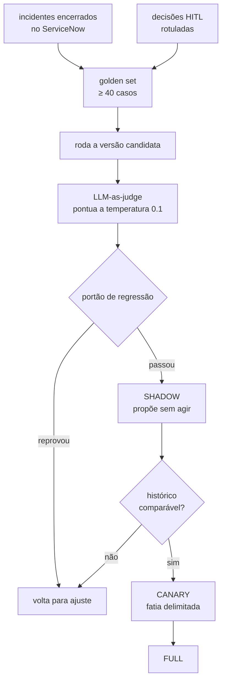

# 11 — MLOps e LLMOps

[← Ecossistema da empresa](10-ecossistema-da-empresa.md) · [Índice](README.md)

---

## As duas observabilidades

Este é o mal-entendido mais comum em projetos AIOps, e vale resolvê-lo antes de qualquer
outra coisa. Há **duas** observabilidades neste sistema:

| | O que observa | Onde vive | Papel |
|---|---|---|---|
| **Dos sistemas monitorados** | Latência, erros, saturação das aplicações | Datadog | É a **entrada** da squad |
| **Da própria squad** | Qual prompt rodou, quanto custou, se o diagnóstico estava certo | Langfuse, LangSmith | É o que torna a autonomia **auditável** |

A primeira já existe na empresa e está em
[10 — Datadog](10-ecossistema-da-empresa.md#datadog). Este documento é sobre a segunda.

A pergunta que ela precisa responder é concreta: *"por que a squad reverteu meu deploy às 3
da manhã?"* — e a resposta não pode ser "o modelo achou que devia". Precisa ser a versão do
prompt, o contexto recuperado, a confiança atribuída, o guardrail que avaliou e a decisão
humana que autorizou. Tudo isso a partir do número do incidente.

> ⚠️ **Estado:** **planejado**. No protótipo, a tela 🔭 LLMOps apresenta os conceitos; no
> pacote Python existem como contrato em
> [`observability.py`](../src/squad_agentica/aiops/observability.py) e
> [`evaluation.py`](../src/squad_agentica/aiops/evaluation.py), sem implementação.

## A stack

| Ferramenta | Papel |
|---|---|
| **LangGraph** | Orquestração em grafo de estados, `interrupt()` para HITL, checkpointing |
| **LangChain** | Abstração de ferramentas, retrievers e integração com os modelos |
| **Langfuse** | Traces, gestão de prompts versionados, custo por execução |
| **LangSmith** | Datasets, execução de avaliações, comparação entre versões |
| **Datadog LLM Observability** | Correlação com o APM dos sistemas monitorados e alertas de qualidade |

Langfuse e LangSmith se sobrepõem em traces; a divisão adotada aqui é **Langfuse para
operação** (o que aconteceu numa execução, quanto custou, qual prompt) e **LangSmith para
avaliação** (datasets, experimentos, comparação entre versões candidatas).

---

## Os nove conceitos

### 1. Trace único ponta a ponta

**O que é.** Um único `trace_id` gerado na detecção e propagado por toda a cadeia: Datadog
APM → LangSmith run → Langfuse → gravado no incidente do ServiceNow.

**Por que importa aqui.** É o que liga a pergunta de auditoria ao artefato técnico. Sem um
identificador comum, investigar uma decisão autônoma vira arqueologia entre quatro
ferramentas com relógios diferentes.

**Como aparece no protótipo.** Como o último elo da cadeia de rastreabilidade
(`dd-9f2c4a1e`), preenchido no primeiro passo de cada cenário. No contrato, é o campo
`trace_id` do `AgentState` e a dataclass `TraceContext`.

### 2. Prompts versionados

**O que é.** Prompt tratado como artefato, não como literal no código: versionado,
promovido por ambiente (`dev` → `staging` → `prod`) e referenciado por id.

**Por que importa aqui.** Prompts mudam comportamento tanto quanto código muda. Se eles
vivem em strings dentro do repositório, "qual prompt produziu esta decisão em março?" não
tem resposta — e sem essa resposta não há investigação de incidente possível.

**No contrato.** `PromptRef(name, version, stage)` e o enum `Stage` em
[`observability.py`](../src/squad_agentica/aiops/observability.py).

### 3. Golden set de incidentes

**O que é.** Incidentes já encerrados no ServiceNow viram casos de avaliação offline, com o
diagnóstico e a natureza corretos conhecidos.

**Por que importa aqui.** É a única forma honesta de medir se uma versão nova do agente é
melhor. E tem uma propriedade rara: **o conjunto cresce sozinho** — o que a squad resolve
hoje é o teste de regressão de amanhã.

**No contrato.** `EvalCase` em
[`evaluation.py`](../src/squad_agentica/aiops/evaluation.py), com
`GOLDEN_SET_MIN_SIZE = 40` — abaixo disso, diferença de score é ruído, não sinal.

No protótipo, o passo de pós-mortem do cenário INC-3312 diz explicitamente que o caso foi
adicionado ao golden set.

### 4. LLM-as-judge com portão de regressão

**O que é.** Um modelo julga a qualidade do diagnóstico produzido por outro, a temperatura
0.1 (ver [03 — governance.py](03-arquitetura-do-codigo.md#governancepy)). O resultado vira
um portão: versão candidata só é promovida se não piorar.

**Por que importa aqui.** Saída de LLM não tem resposta única esperada — duas explicações
diferentes de causa raiz podem estar ambas corretas. Não dá para testar isso com
`assert ==`.

**Os limiares, e por que são diferentes:**

| Métrica | Limiar | Racional |
|---|---|---|
| `MIN_ROOT_CAUSE_SCORE` | 0.80 | Explicação imprecisa custa tempo de leitura |
| `MIN_REMEDIATION_KIND_ACCURACY` | **0.90** | Errar a natureza manda o incidente pelo caminho errado inteiro |
| `MAX_REGRESSION_TOLERANCE` | 0.02 | Margem para ruído estatístico, não para piora real |

O teste `test_regression_gate_thresholds` trava a **relação** entre os dois primeiros —
o mesmo padrão usado nas temperaturas: preserva o princípio sem engessar o número.

### 5. Shadow mode e canário

**O que é.** Três níveis de autoridade para uma versão de agente:

| Modo | O que faz |
|---|---|
| `SHADOW` | Roda sobre incidentes reais registrando **o que faria**. Nunca age. |
| `CANARY` | Age sobre uma fatia pequena e delimitada dos incidentes. |
| `FULL` | Age sobre todos os incidentes elegíveis. |

**Por que importa aqui.** É o que torna autonomia aceitável numa organização avessa a
risco. A versão nova acumula um histórico comparável contra tráfego real **antes** de ter
permissão para tocar em qualquer coisa. Numa apresentação, é a resposta para "e se ele
errar?": ele erra em shadow, onde errar não custa nada.

**No contrato.** Enum `RolloutMode` em
[`evaluation.py`](../src/squad_agentica/aiops/evaluation.py).

### 6. Feedback loop do HITL

**O que é.** Cada aprovação e cada rejeição na fila HITL — com a justificativa — vira dado
rotulado.

**Por que importa aqui.** A fila HITL costuma ser vista só como portão de segurança. Ela é
também a **principal fonte de supervisão** do sistema: é gente experiente dizendo, caso a
caso, se a squad propôs a coisa certa. Jogar esse sinal fora é desperdiçar a parte mais
cara do processo.

**No protótipo.** O histórico de decisões na tela HITL, com o tipo de gate e o desfecho de
cada uma.

### 7. Drift em dois níveis

**O que é.** Deriva silenciosa, em duas camadas distintas:

| Nível | O que deriva | Como aparece |
|---|---|---|
| **Detecção** | Os baselines: o que era anômalo deixou de ser | Alarmes falsos, ou anomalias que passam batido |
| **Agente** | A precisão do diagnóstico ao longo do tempo | Nada quebra — a qualidade só escorrega |

**Por que importa aqui.** O segundo é o perigoso, justamente porque não gera erro. O
sistema continua respondendo, continua abrindo GMUDs, continua propondo remediações — só
que piores. Sem medir contra o golden set periodicamente, ninguém percebe.

### 8. Redação antes da saída

**O que é.** Código e logs passam por remoção de segredos e dados pessoais **antes** de
irem para um agente externo, e só repositórios da allowlist são elegíveis.

**Por que importa aqui.** Delegar a correção ao Devin significa que código-fonte da empresa
atravessa uma fronteira organizacional. Essa é a primeira objeção que segurança levanta, e
ela precisa de resposta no **contrato**, não no adaptador — por isso são constantes
booleanas ligadas, com teste garantindo que continuem assim:

```python
REDACTION_REQUIRED_BEFORE_EGRESS = True
REPOSITORY_ALLOWLIST_REQUIRED = True
```

**No protótipo.** É um passo visível do cenário INC-3312 (o guardrail G-05 roda antes do
Artífice clonar) e um painel na tela de Configuração.

### 9. Orçamento por execução

**O que é.** Teto de tokens por agente e por incidente, com corte automático.

**Por que importa aqui.** Um agente em laço não pode virar uma fatura surpresa. E o custo
por natureza é informação de negócio útil: no protótipo, `INFRA` custa US$ 0,31 por
incidente e `CODIGO` custa US$ 1,12 — ainda assim comparado a dias de trabalho humano no
processo manual.

Conecta com a política que já existia em
[06 — Governança FinOps](06-arquitetura-alvo.md#governança-finops).

---

## O ciclo de promoção de uma versão

Juntando as peças, é assim que uma mudança em qualquer agente chega a produção:



Note que o loop se fecha: as decisões humanas na fila HITL realimentam o golden set, que é
o que avalia a próxima versão. Quanto mais a squad é usada, melhor fica o critério que
julga suas mudanças.

---

## O que isso muda na conversa com o comitê

Três perguntas que costumam decidir a aprovação de um projeto assim, e onde cada uma é
respondida:

| Pergunta | Resposta | Onde |
|---|---|---|
| "E se ele errar?" | Erra em shadow mode, sem agir; e nas ações reais há guardrails e HITL | Conceitos 5 e [10](10-ecossistema-da-empresa.md#onde-a-decisão-continua-sendo-humana) |
| "Como eu audito uma decisão automática?" | Trace único do incidente até a chamada de modelo, com prompt versionado | Conceitos 1 e 2 |
| "Vocês vão mandar nosso código para fora?" | Só repositórios autorizados, redigidos, com clone raso e PR revisado | Conceito 8 e [10](10-ecossistema-da-empresa.md#a-política-de-código) |

---

[← Ecossistema da empresa](10-ecossistema-da-empresa.md) · [Índice](README.md)
